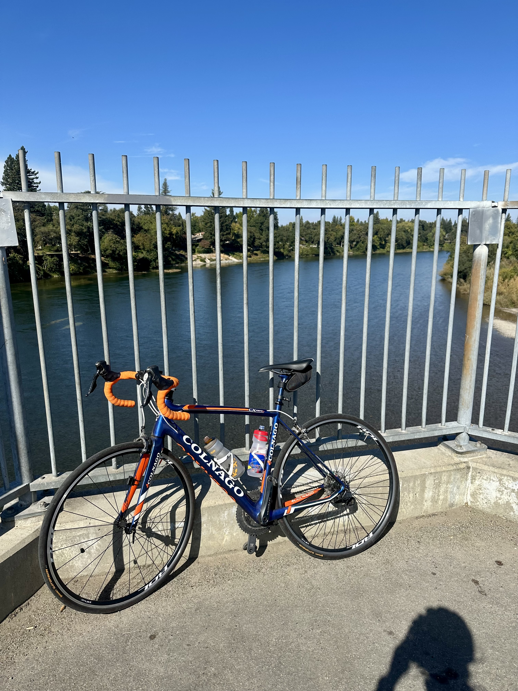

```{r setup, include=FALSE}
knitr::opts_chunk$set(echo = TRUE)
```


# Cycling 
I spend a lot of my free time in the saddle. For 22 years, my father, a prolific biker, tried to convert me from a runner to a cyclist. After breaking my hip, both shins, a foot, a toe, and partially tearing my quad, I transitioned my Nikes to Shimanos.


#### My road bike, a Colnago CX Zero Evo.


#### And my newest addition, a Trek Domane. 


<br/>
Recently, I've started integrating gravel rides into my routine as I prepare for a 200km ride in [Iceland, July 2024](https://www.therift.bike/). 

<br/>


<br/>
*Hey, like this animation? Create your own! Copy my code [here](./data/hobbies/code_repo/mapmyride.py)*


# Fostering (dogs)


 

